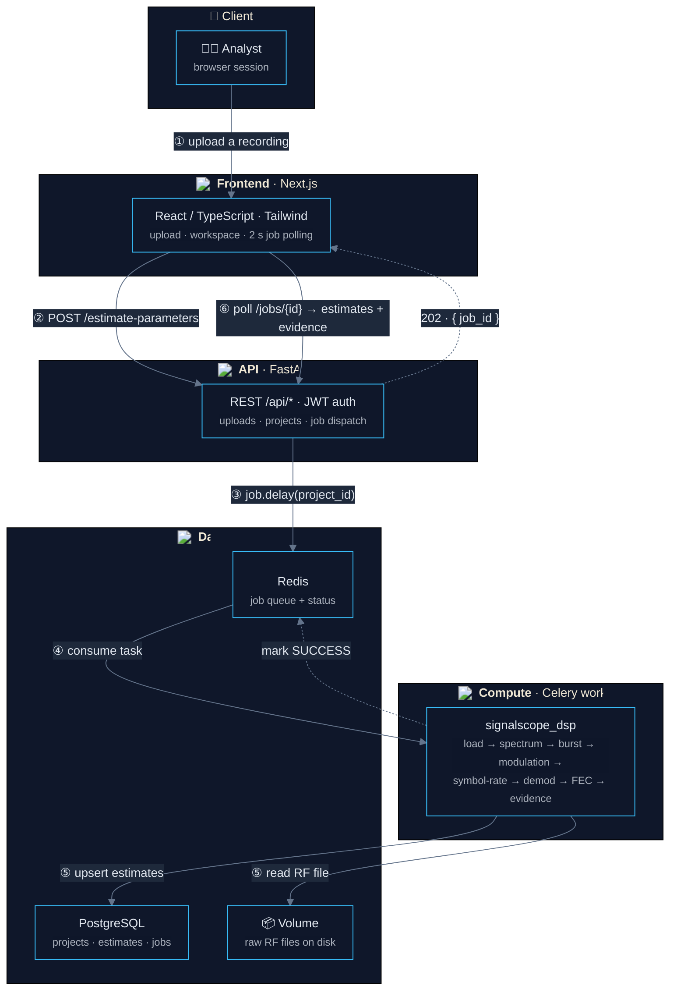
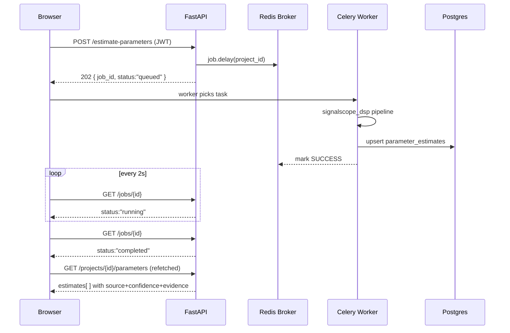

# 🏗️ SignalScope AI — System Architecture

**A deep dive into how the pieces fit together: services, tech stacks, and the DSP processing flow.**

---

---

## 🗺️ System Overview

**Five layers, one goal: turn raw RF recordings into *explainable* parameter estimates.** The request path is fully async — the browser fires an analysis job, Celery executes the DSP pipeline in the background, and the frontend polls the job status until results land in Postgres.

---

## 📐 System Design Diagram

---

## 🧩 Decomposition Notes

### 1. Client Layer
The browser is a pure **JWT cookie-authenticated** SPA. TanStack Query owns server-state: the job is polled every **2 s** while `queued`/`running`, and the parameter-estimate query is **invalidated and refetched automatically the moment the job flips to `completed`**. No hard refreshes — results stream in.

### 2. Application Layer (FastAPI)
- Auth with `argon2` password hashing, JWT in an httpOnly cookie (Bearer fallback for API tooling).
- All uploads validated for type (`wav/raw/sigmf`) and size (200 MB cap).
- `POST /api/projects/{id}/estimate-parameters` returns **202 Accepted** with a `job_id` — the client never blocks.

### 3. Compute Layer (Celery Worker)
- Consumes tasks from **Redis db 1**, reports results to **Redis db 2**.
- Runs `signalscope_dsp` — the same library is `pip install -e`'d into the worker **and** the API, so estimates and pre-checks can never drift out of sync.

### 4. DSP Pipeline
`load → crop → spectral/burst analysis → modulation → symbol rate → demod → de-interleave → FEC → bit correlation → provenance assembly`. Every stage emits candidates with **evidence strings**; the final `Estimate` carries `{name, value, unit, source, confidence, alternatives, warnings}`.

### 5. Data Layer
- **Postgres** — relational store for users, projects, recordings, jobs, and `parameter_estimates` (JSONFlex `value_json` + `evidence_json`).
- **Redis db 0** — rate-limit counters and job-metadata lookups.
- **Volume** — recorded RF files kept on disk, referenced from the DB, never in-memory.

---

## 🔄 Request / Lifecycle Flow

---

## 💻 Local Development Topology

| Container | Image build | Exposed port | Role |
|-----------|-------------|--------------|------|
| `web` | `docker/Dockerfile.web` | `3000` | Next.js standalone server |
| `api` | `docker/Dockerfile.api` | `8000` | FastAPI + `/docs` |
| `worker` | `docker/Dockerfile.worker` | — | Celery DSP executor |
| `postgres` | `postgres:16-alpine` | `5432` | Primary datastore |
| `redis` | `redis:7-alpine` | `6379` | Broker + backend + cache |

> The dev overlay (`docker-compose.dev.yml`) adds hot-reload for api/worker. Run the web dev server on the host for frontend HMR.

---

**_"Every number is an estimate. Every estimate has a source, a confidence, and evidence you can read."_**

[← Back to README](./README.md)

