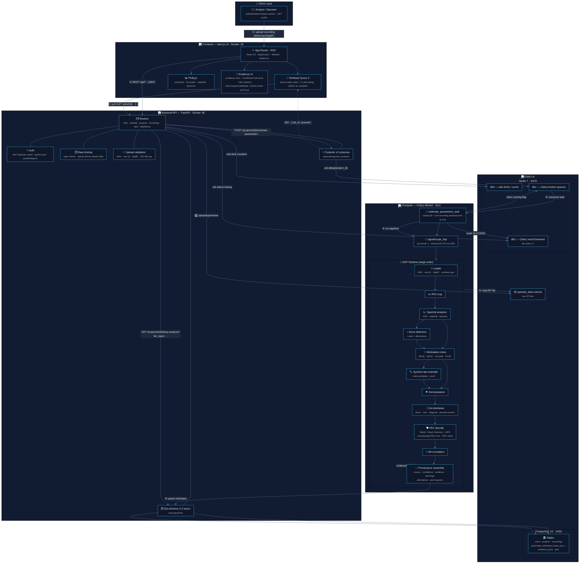
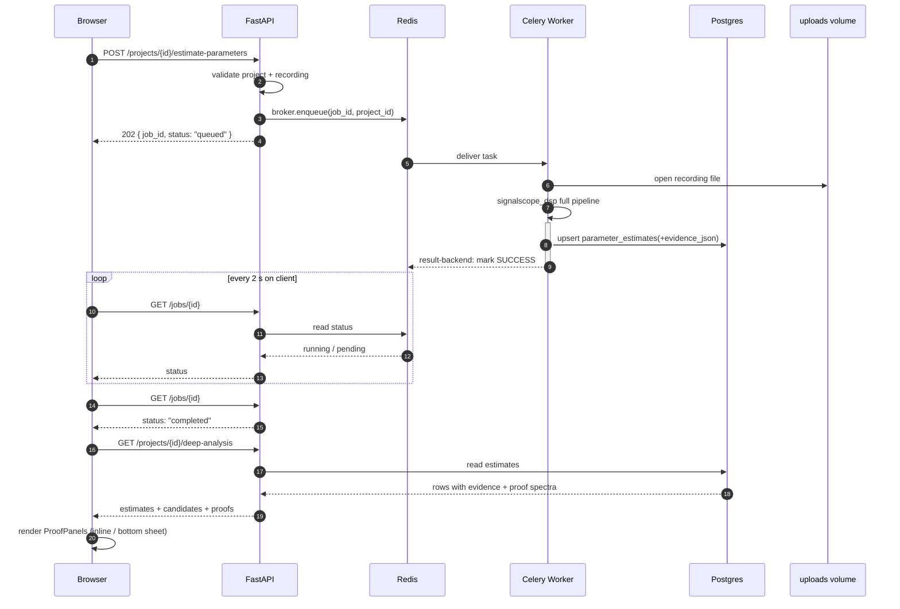

# 🛠️ SignalScope AI — Detailed Technical Architecture

**A complete, low-level view: every service, port, data store, message hop, and DSP stage.**

---

## 🧱 Service Topology

| Container | Tech | Port | Role |
|-----------|------|------|------|
| `web` | Next.js 14 · React 18 · TypeScript 5 · Tailwind · shadcn/ui | `3000` | SPA + SSR shell, TanStack Query polling, Plotly visualizations |
| `api` | FastAPI 0.115 · Pydantic v2 · SQLAlchemy 2.0 async | `8000` | REST gateway: auth, uploads, projects, recordings, jobs, dashboard |
| `worker` | Celery 5.5 · `signalscope_dsp` (editable) | — | Background executor for the DSP pipeline |
| `postgres` | PostgreSQL 16 | `5432` | Primary relational store |
| `redis` | Redis 7 | `6379` | db0 rate-limit/cache · db1 Celery broker · db2 result backend |
| `uploads_data` | Docker volume | — | Raw RF recordings on disk (never in memory) |

---

## 🧠 Detailed System Diagram

---

## 🔄 Async Job Lifecycle

---

**_"Every number is an estimate. Every estimate has a source, a confidence, and evidence you can read."_**

[← Back to README](./README.md)

